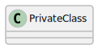
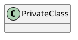
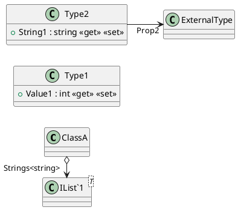

Generated by [dotnet-diagram](https://github.com/sator-imaging/dotnet-diagram)

# PrivateOnly

PlantUML

```plantuml
@startuml
left to right direction
class PrivateClass {
}
@enduml
```

# Tests

PlantUML

```plantuml
@startuml
left to right direction
class ClassA {
}
class Type1 {
    + Value1 : int <<get>> <<set>>
}
class Type2 {
    + String1 : string <<get>> <<set>>
}
class "IList`1"<T> {
}
ClassA o-> "Strings<string>" "IList`1"
Type2 --> "Prop2" ExternalType
@enduml
```

